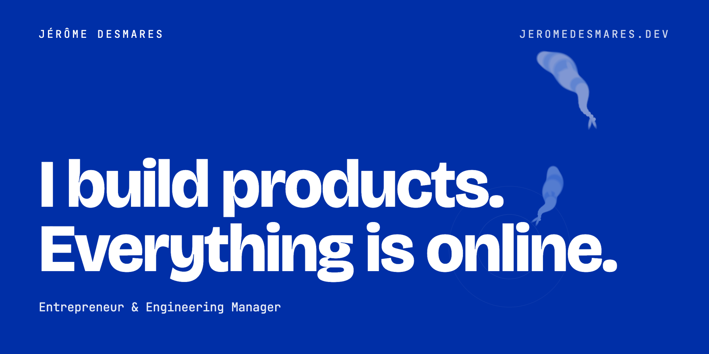
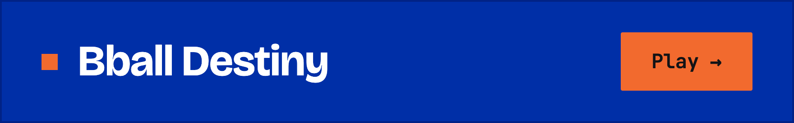
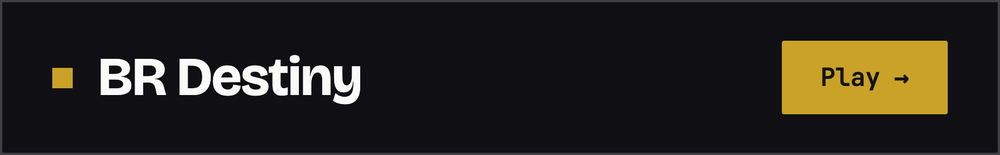
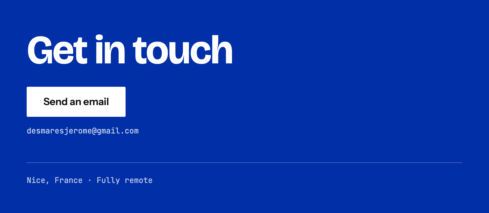

Products I code alone, websites delivered for clients, and two games built for the fun of it.

## What I build

**[Livia](https://livia.tech)** &nbsp;<samp>PRODUCT · QUALIOPI COMPLIANCE</samp> 
An AI agent for French training organisations: it tracks Qualiopi compliance continuously, prepares audits and flags what is missing before the auditor finds it. I write the product alone, from first commit to production.

**[Lecturer](https://lecturer.fr)** &nbsp;<samp>PRODUCT · HIGHER EDUCATION</samp> 
Builds the timetables of schools and universities and manages contract lecturers in the same place. What used to cost an academic team eleven hours a week now costs one.

**[Coucou IA](https://coucou-ia.com)** &nbsp;<samp>FIRM · AI CONSULTING</samp> 
AI consulting for small and mid-market companies, from idea to production: audit, scoping, then the code. All my client work goes through Coucou IA.

**[Hubskillz](https://hubskillz.com)** &nbsp;<samp>PRODUCT · CLAUDE CODE SKILLS</samp> 
A shared catalogue of Claude Code skills: one validated version of each skill, kept current on every machine and in every project across the team. Free for solo use. The CLI is open source: [hubskillz-cli](https://github.com/JejeDurden2/hubskillz-cli).

## Sites delivered

**[Watu Care](https://watu-care.com)** &nbsp;<samp>B2B MEDICAL WHOLESALE</samp> 
Connects Asian medical device manufacturers with healthcare providers across Africa and the Middle East.

**[MP Training](https://mptraining.fr)** &nbsp;<samp>PERSONAL TRAINING</samp> 
A private coaching studio in central Nice: programmes, coaches and session booking.

**[La Bastide de Monique](https://www.bastidedemonique.fr)** &nbsp;<samp>BED AND BREAKFAST</samp> 
A four-room bed and breakfast in Flassans-sur-Issole, Provence: rooms, rates and stay enquiries.

## The Destiny series

<samp>BASKETBALL · NBA CAREER SIMULATOR · FREE</samp> 
Start at 16, make the calls and see how far your career goes, from high school to the Hall of Fame.

<samp>BATTLE ROYALE · WARZONE-STYLE · FREE</samp> 
Drop into a 100-player battle royale, loot your loadout, fight the gulag and go for the Top 1.

## About

Ten years of building: an online store scaled solo, code for systems that move real money, then the engineering teams I grew. Today I build my own products and write the code myself.

[The full background](https://jeromedesmares.dev/en/about) · [LinkedIn](https://linkedin.com/in/jeromedesmares) · [desmaresjerome@gmail.com](mailto:desmaresjerome@gmail.com)

